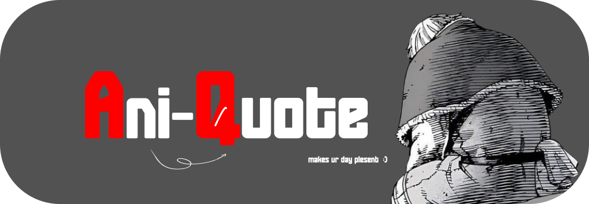

# Ani-Quote

<div align="center">
  
  <br />
  <br />
  <p>
    <b>A modern React application that fetches and displays quotes from your favorite Anime using the Animechan API.</b>
  </p>
  <p>
    <a href="https://aniquote-ten.vercel.app">View Demo</a>
    ·
    <a href="https://github.com/ajaykumarreddy-k/Ani-Quote/issues">Report Bug</a>
    ·
    <a href="https://github.com/ajaykumarreddy-k/Ani-Quote/issues">Request Feature</a>
  </p>
</div>

---

## 📖 About The Project

**Ani-Quote** is a random anime quote generator built with React and TypeScript. It utilizes the [Animechan API](https://animechan.io/) to serve fresh, inspiring, and fun quotes from various anime series. Whether you're a developer looking for a fun API integration example or an anime fan, this project is for you.

### ✨ Features

* **Random Quote Generation**: Instantly fetch a new anime quote with a click.
* **Responsive Design**: optimized for both desktop and mobile viewing.
* **Modern Tech Stack**: Built with the speed of Vite and the type safety of TypeScript.

## 🛠️ Tech Stack

* **Framework**: [React](https://reactjs.org/)
* **Language**: [TypeScript](https://www.typescriptlang.org/)
* **Build Tool**: [Vite](https://vitejs.dev/)
* **Styling**: CSS (Custom styles)
* **API**: [Animechan](https://animechan.io/)

## 🚀 Run Locally

Follow these steps to get a local copy up and running.

### Prerequisites

* **Node.js** (v14 or higher recommended)
* **npm**

### Installation

1.  **Clone the repository**
    ```bash
    git clone [https://github.com/ajaykumarreddy-k/Ani-Quote.git](https://github.com/ajaykumarreddy-k/Ani-Quote.git)
    ```

2.  **Navigate to the project directory**
    ```bash
    cd Ani-Quote
    ```

3.  **Install dependencies**
    ```bash
    npm install
    ```

4.  **Start the development server**
    ```bash
    npm run dev
    ```

5.  **Open your browser**
    Navigate to `http://localhost:5173` (or the port shown in your terminal) to view the app.

## 📂 Project Structure

```text
Ani-Quote/
├── components/       # Reusable UI components
├── features/         # Feature-specific logic (e.g., quotes fetching)
├── public/           # Static assets (Logo, etc.)
├── styles/           # Global CSS and styling files
├── App.tsx           # Main application component
├── index.tsx         # Entry point
├── vite.config.ts    # Vite configuration
└── package.json      # Dependencies and scripts


🔗 API Reference
This project uses the Animechan API.

Docs: https://animechan.io/docs

🤝 Contributing
Contributions are what make the open-source community such an amazing place to learn, inspire, and create. Any contributions you make are greatly appreciated.

Fork the Project

Create your Feature Branch (git checkout -b feature/AmazingFeature)

Commit your Changes (git commit -m 'Add some AmazingFeature')

Push to the Branch (git push origin feature/AmazingFeature)

Open a Pull Request

👤 Author
Ajay Kumar Reddy

GitHub: @ajaykumarreddy-k

<div align="center"> <sub>Built with ❤️ by Ajay Kumar Reddy</sub> </div>


Perfect Comparable and Tested to  Linix Ubantu 25.0.0
- Questioning 